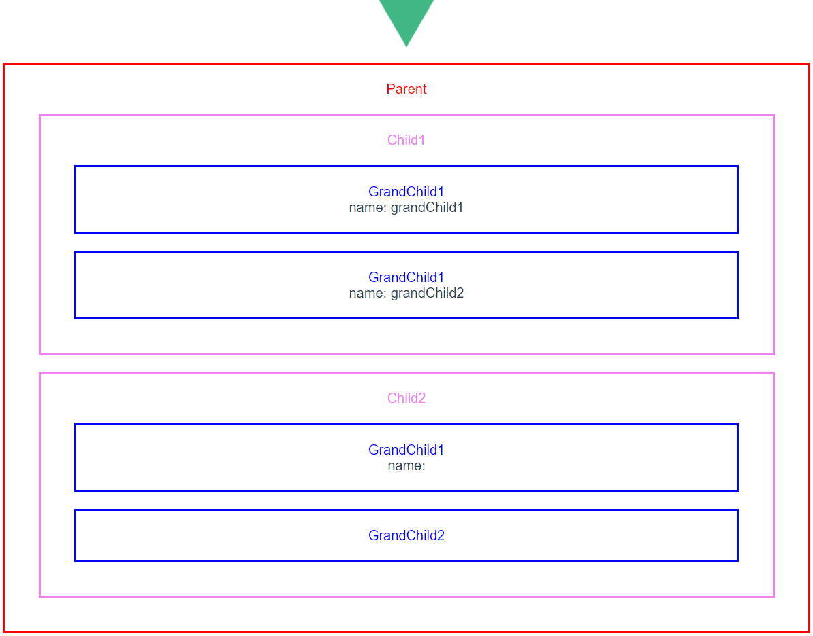
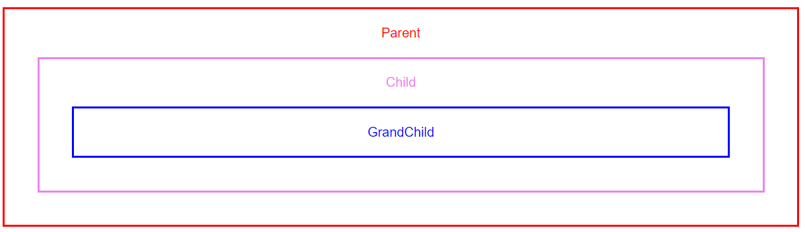
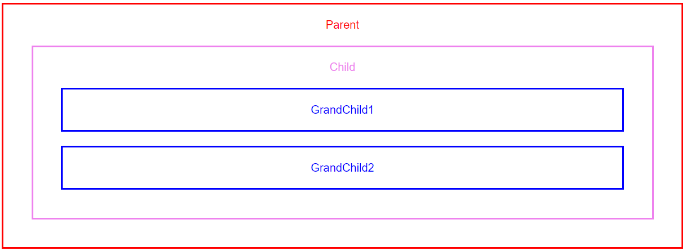
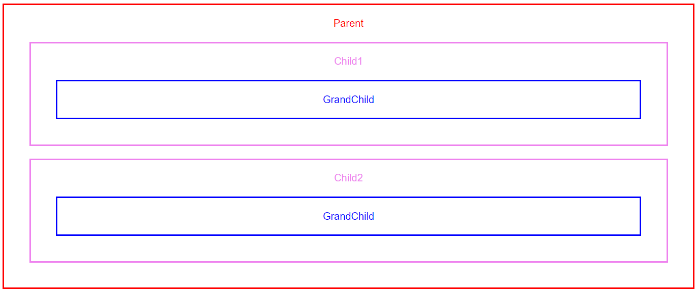

# Vue의 라이프사이클 - beforeCreate, created, beforeMount, mounted

Created: Jan 14, 2020 3:13 PM
Property: Frontend
Tags: Vue

Vue 컴포넌트의 라이프사이클 상에서 `beforeCreate` , `created` , `beforeMount` , `mounted` 각각의 훅을 지정할 수 있다. 이 때 하위 컴포넌트에 대해 각각의 훅이 실행되는 순서는 아래와 같다.

## 실행 순서

- 최상위 컴포넌트(Parent)의 `beforeCreate` , `created` , `beforeMount` 가 실행된다.
  - 그 다음 컴포넌트(Child)의 `beforeCreate` , `created` , `beforeMount` 가 실행된다.
    - 최하위 컴포넌트를 만날 때까지 계속하여 실행된다.
    - 최하위 컴포넌트의 `beforeCreate` , `created` , `beforeMount` , `mounted` 가 실행된다.
    - 바로 위 컴포넌트의 `mounted` 가 실행된다.
  - 최상위 컴포넌트를 만날 때까지 계속하여 `mounted` 가 실행된다.
- 최상위 컴포넌트(Parent)의 `mounted` 가 실행된다.

이 때 한 단계에서 여러 개의 컴포넌트가 실행되는 경우, 아래의 모든 `beforeCreate` , `created` , `beforeMount` 가 처리된 후 `created` 된 순서대로 `mounted` 된다.

### 예시 1

**컴포넌트 구조**

    Parent.vue
    	- Child.vue
    		- GrandChild.vue

**출력 순서**

    Parent ::: beforeCreate
    Parent ::: created
    Parent ::: beforeMount
    
    	Child ::: beforeCreate
    	Child ::: created
    	Child ::: beforeMount
    	
    		GrandChild ::: beforeCreate
    		GrandChild ::: created
    		GrandChild ::: beforeMount
    		GrandChild ::: mounted
    	
    	Child ::: mounted
    
    Parent ::: mounted

### 예시 2

**컴포넌트 구조**

    Parent.vue
    	- Child.vue
    		- GrandChild1.vue
    		- GrandChild2.vue

**출력 순서**

    Parent ::: beforeCreate
    Parent ::: created
    Parent ::: beforeMount
    
    	Child ::: beforeCreate
    	Child ::: created
    	Child ::: beforeMount
    	
    		GrandChild1 ::: beforeCreate
    		GrandChild1 ::: created
    		GrandChild1 ::: beforeMount
    		
    		GrandChild2 ::: beforeCreate
    		GrandChild2 ::: created
    		GrandChild2 ::: beforeMount
    		
    		GrandChild1 ::: mounted
    		GrandChild2 ::: mounted
    	
    	Child ::: mounted
    
    Parent ::: mounted

### 예시 3

**컴포넌트 구조**

    Parent
    	- Child1
    		- GrandChild
      - Child2
    		- GrandChild

**출력 순서**

    Parent ::: beforeCreate
    Parent ::: created
    Parent ::: beforeMount
    
    	Child1 ::: beforeCreate
    	Child1 ::: created
    	Child1 ::: beforeMount
    	
    		GrandChild ::: beforeCreate
    		GrandChild ::: created
    		GrandChild ::: beforeMount
    		GrandChild ::: mounted
    	
    	Child2 ::: beforeCreate
    	Child2 ::: created
    	Child2 ::: beforeMount
    		
    		GrandChild ::: beforeCreate
    		GrandChild ::: created
    		GrandChild ::: beforeMount
    		GrandChild ::: mounted
    	
    	Child1 ::: mounted
    	Child2 ::: mounted
    
    Parent ::: mounted

### 예시 4

**컴포넌트 구조**

    Parent
    	- Child1
    		- GrandChild1-1
    		- GrandChild1-2
      - Child2
    		- GrandChild2-1
        - GrandChild2-2

**출력 순서**

    Parent ::: beforeCreate
    Parent ::: created
    Parent ::: beforeMount
    
    	Child1 ::: beforeCreate
    	Child1 ::: created
    	Child1 ::: beforeMount
    	
    		GrandChild1-1 ::: beforeCreate
    		GrandChild1-1 ::: created
    		GrandChild1-1 ::: beforeMount
    		
    		GrandChild1-2 ::: beforeCreate
    		GrandChild1-2 ::: created
    		GrandChild1-2 ::: beforeMount
    		
    		GrandChild1-1 ::: mounted
    		GrandChild1-2 ::: mounted
    	
    	Child2 ::: beforeCreate
    	Child2 ::: created
    	Child2 ::: beforeMount
    	
    		GrandChild2-1 ::: beforeCreate
    		GrandChild2-1 ::: created
    		GrandChild2-1 ::: beforeMount
    		
    		GrandChild2-2 ::: beforeCreate
    		GrandChild2-2 ::: created
    		GrandChild2-2 ::: beforeMount
    		
    		GrandChild2-1 ::: mounted
    		GrandChild2-2 ::: mounted
    	
    	Child1 ::: mounted
    	Child2 ::: mounted
    
    Parent ::: mounted

- **참고 : vue lifecycle**

  